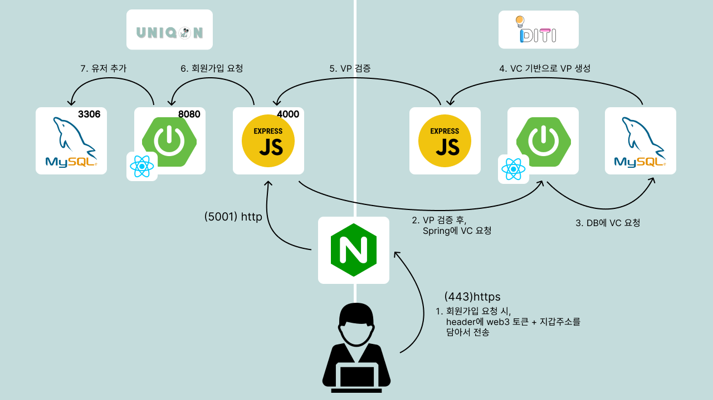
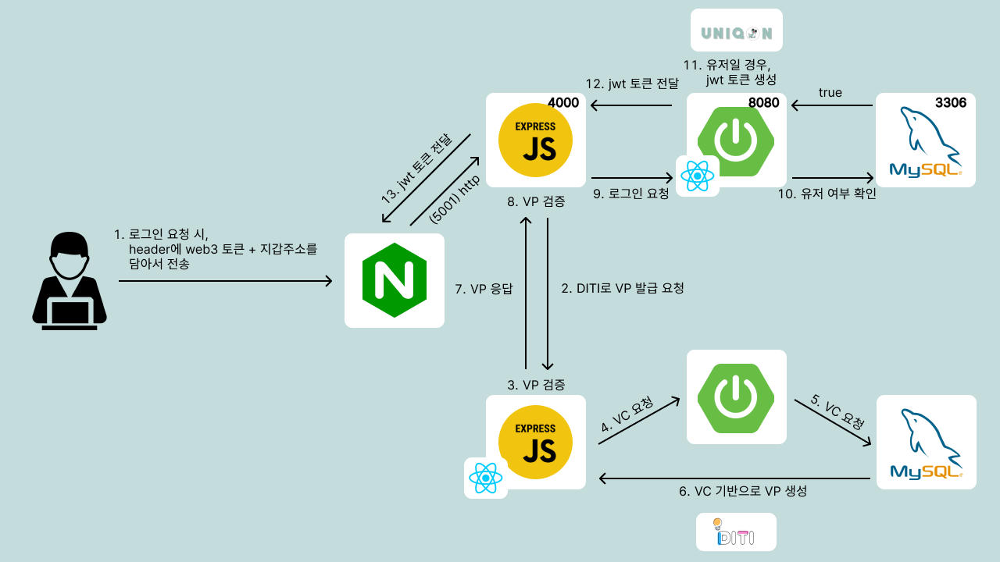
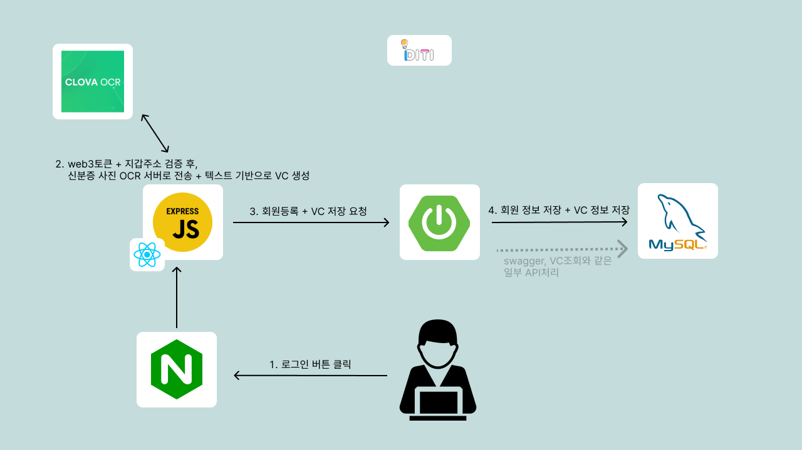
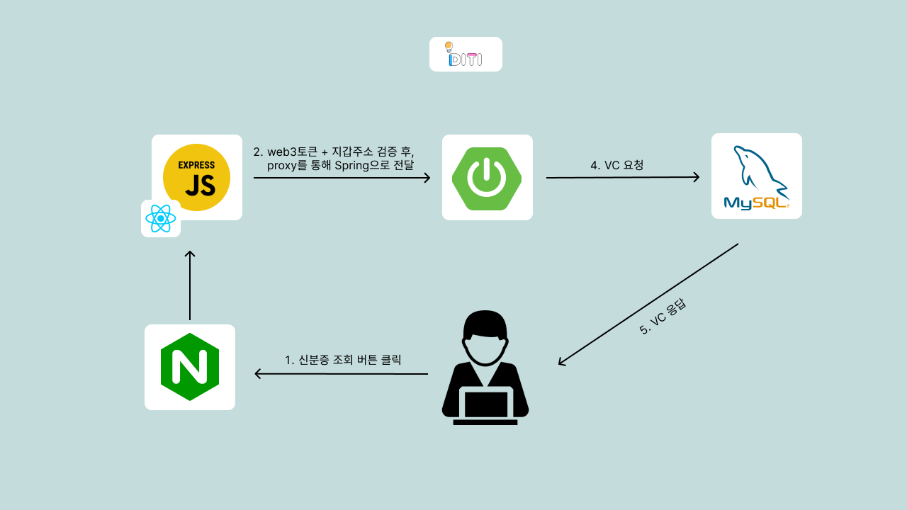

# Uniqon

## 📚 서비스 소개

- 웹 3.0은 사용자 중심의 인터넷 환경으로, 개인화된 서비스와 데이터의 소유권이 강조됩니다. 이러한 환경에서 **NFT (Non-Fungible Token)** 는 디지털 자산의 고유성과 소유권을 증명할 수 있는 기술로 주목받고 있습니다.
- 이러한 배경에서 시작한 저희의 **희귀동물 NFT 거래 플랫폼**은 본인이 소유한 희귀동물을 NFT로 발행하여 거래함으로써, 디지털 컨텐츠의 가치를 높일 수 있으며,희귀동물의 보호와 관리에 대한 관심을 높이고, 생태계를 활성화할 수 있습니다. 또한, 블록체인 기술을 활용하여 신뢰성을 높일 수 있습니다.
 

## 🗓 개발 기간

- 2023.08.23 ~ 10.06 (6주)
 

## 👨‍👨‍👦 팀 구성 
<table align="center">
    <tr align="center">
        <td><a href="https://github.com/JeBread">
             
            <b>방상제</b></a>
              Frontend 
        </td>
        <td><a href="https://github.com/cjjss11">
             
            <b>최지수</b></a>
              Frontend  
        </td>
        <td><a href="https://github.com/ji-hyon">
             
            <b>서지현</b></a>  
              BlockChain / DevOps
        </td>
        <td><a href="https://github.com/kmr5326">
             
            <b>김한결</b></a>
              BlockChain / DevOps  
        </td>
        <td><a href="https://github.com/asdqwe45">
             
            <b>이재명</b></a>
              Backend / AI
        </td>
        <td><a href="https://github.com/cutepassion">
             
            <b>진병욱</b></a>
              Backend 
        </td>
    </tr>
</table>
 

## ⚙ 기능소개

### (1) DITI (Decentralized Identity Trust Infrastructure)

|1. 메인화면 + 로그인 |2. VC 발급|3. VC 조회|
|:---:|:---:|:---:|
||||

### (2) UNIQON (UNIQUE + ON)

|1. 메인화면 |2. 로그인|3. 회원가입|
|:---:|:---:|:---:|
||||

|4. nft발급|5. 거래|
|:---:|:---:|
|||

|6. 도감|7. 내 정보|
|:---:|:---:|
|||
 

    
# Uniqon 회원가입 흐름도

# Uniqon 로그인 흐름도

# DITI 로그인/회원가입 흐름도

# DITI 인증서 조회 흐름도

# 🛠 사용 기술 및 라이브러리

## Front-End

## Back-End

