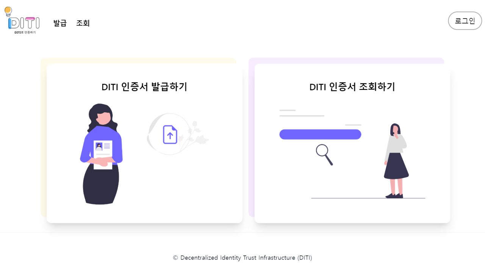
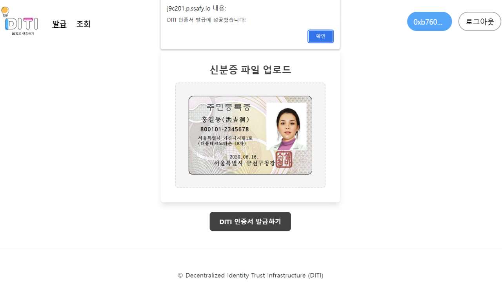
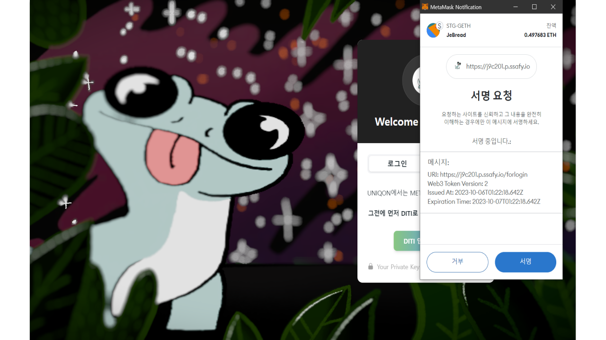
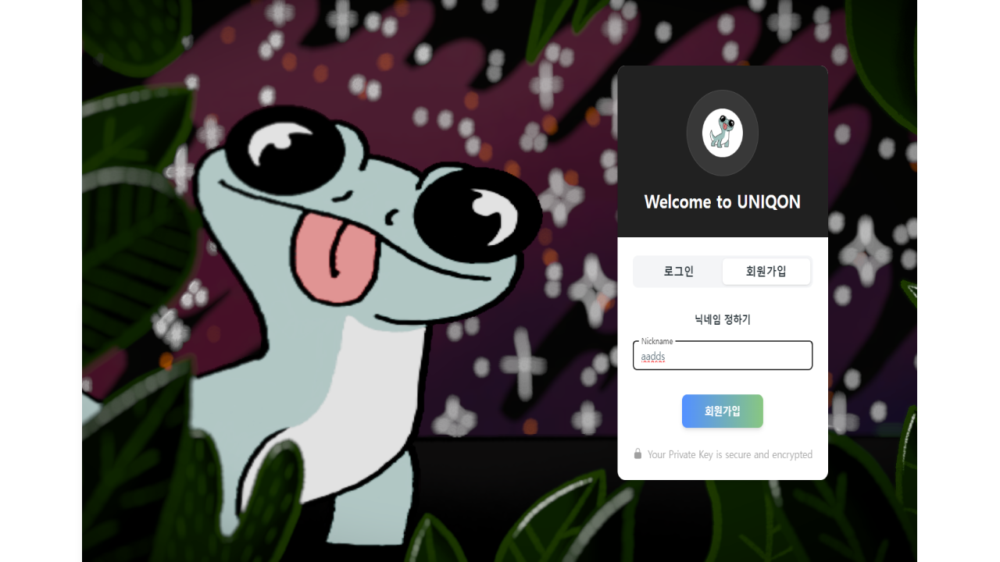
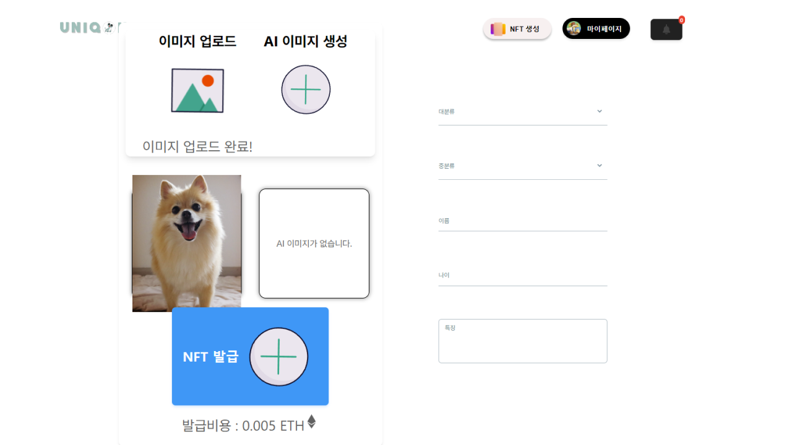
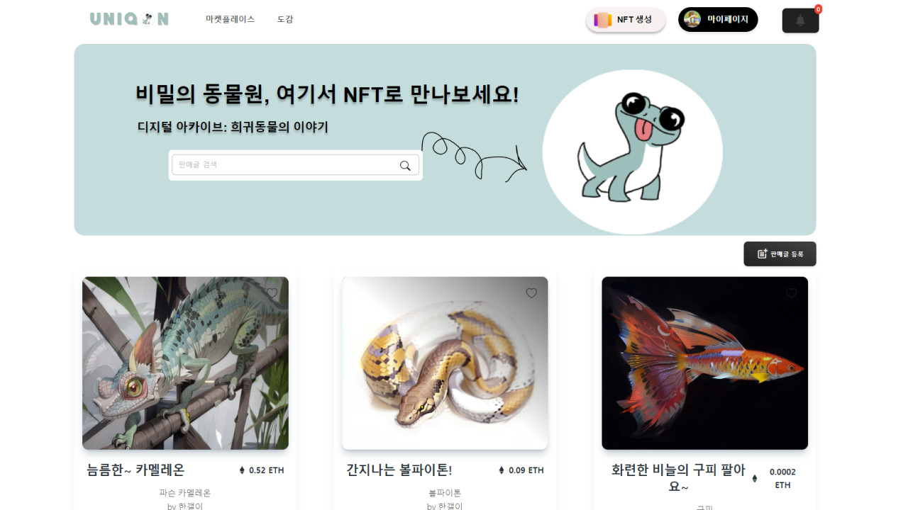
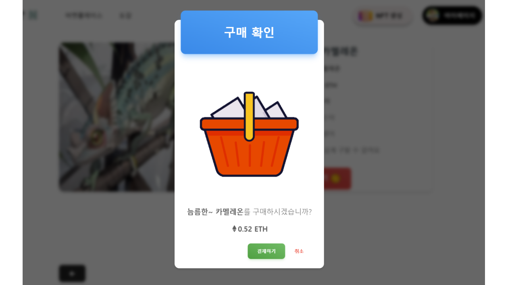
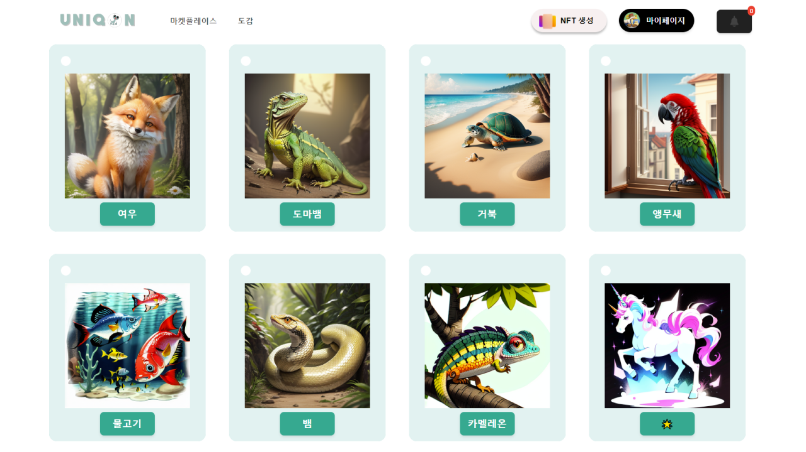
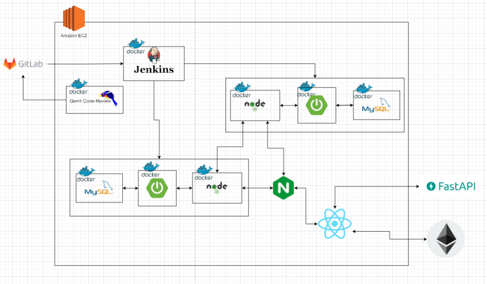

<div align="center">

# Uniqon

</div><br>

## 📚 서비스 소개
- AI를 기반으로 자신이 소유한 희귀동물의 이미지를 생성할 수 있고, 이를 NFT(Non-Fungible Token)로 발행하여 거래할 수 있습니다.
- 도감을 통해 각 희귀동물에 대한 상세한 정보를 얻을 수 있습니다. 
- Metamask와 인증기관(DITI)에서 DID(탈중앙화 신원증명)를 기반으로 발행한 인증서를 기반으로 간편 로그인이 가능합니다. 
<br>

## 🗓 개발 기간
- 2023.08.23 ~ 2023.10.06 (6주)
<br>

## 👨‍👨‍👦 팀 구성 
<table align="center">
    <tr align="center">
        <td><a href="https://github.com/JeBread">
            <br />
            <sub><b>방상제</b></sub></a>
            <br/> Frontend 
            <br/> <br/>
        </td>
        <td><a href="https://github.com/cjjss11">
            <br />
            <sub><b>최지수</b></sub></a>
            <br /> Frontend  
            <br/> <br/>
        </td>
        <td><a href="https://github.com/ji-hyon">
            <br />
            <sub><b>서지현</b></sub></a>  
            <br /> BlockChain
            <br/> DevOps
        </td>
        <td><a href="https://github.com/kmr5326">
            <br />
            <sub><b>김한결</b></sub></a>
            <br /> BlockChain
            <br/> DevOps  
        </td>
        <td><a href="https://github.com/asdqwe45">
            <br />
            <sub><b>이재명</b></sub></a>
            <br /> Backend
            <br/> AI
        </td>
        <td><a href="https://github.com/cutepassion">
            <br />
            <sub><b>진병욱</b></sub></a>
            <br /> Backend 
            <br/> <br/>
        </td>
    </tr>
</table>
<br>

## 🔎 기능소개

### (1) DITI (Decentralized Identity Trust Infrastructure) - 블록체인 기반 신원 인증 서비스

|1. 메인화면 + 로그인 |2. VC 발급|3. VC 조회|
|:---:|:---:|:---:|
||||

### (2) UNIQON (UNIQUE + ON) - NFT 거래 서비스

|1. 로그인|2. 회원가입|
|:---:|:---:|
|||

|4. NFT 발급|5. NFT 거래 목록|
|:---:|:---:|
|||

|6. NFT 거래|7. 도감|
|:---:|:---:|
|||
<br>

## 🎫 DID 인증서 기반 로그인 흐름도
### (1) Uniqon 회원가입
<div align="center">
    
</div>

### (2) Uniqon 로그인 
<div align="center">
    
</div>

### (3) DITI 로그인/회원가입 
<div align="center">
    
</div>

### (4) DITI 인증서 조회 
<div align="center">
    
</div>
<br>

## ⚙ 시스템 아키텍처 
<div align="center">
    
</div>
<br>


## 🛠 사용 기술 및 라이브러리

### Front-End
```
react [18.2.0]
zustand [4.4.1]
tailwindcss [3.3.3]
three.js [0.154.0]
```
### block-Chain
```
ethers [6.7.1]
web3_token [1.0.6]
```
### Back-End
```
Java [17]
springboot [3.1.3]
springsecurity [3.1.3]
JPA [3.1.4]
mysql [8.0.33]
swagger [2.2.0]
```
